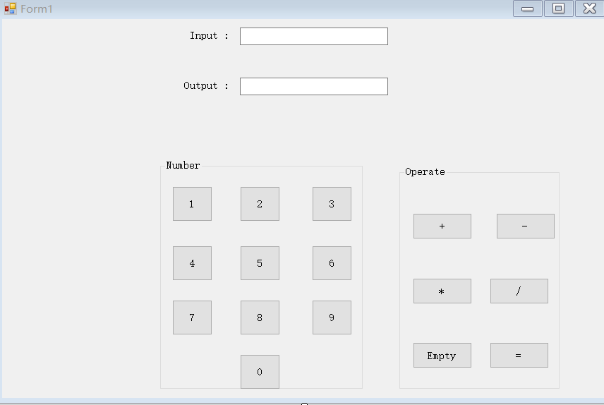

# 基于Winform的小demo简介
## 1.功能简介
    我做的这个小demo是一个窗口程序，一个主窗口（form1），三个子窗口（form2，form3，form4)。第一个窗口是功能选择界面，有三个功能供选择：日历、计算器和24点小游戏。点击对应的功能旋钮，就可以跳转到对应的子窗口。
### 1.日历
    对应form2，进入界面后可以查看当前年月日。
### 2.计算器
    对应form3，进入界面后可以计算两个数字的加减乘除运算：在前两个Textbox中分别输入一个数字，再选择一个运算符，点击calculate键即可在第三个Textbox中得到运算结果。
### 3.24点小游戏
    对应form4，进入界面后点击start，上方的四个Textbox会分别输出一个1~9之间的随机数，玩家用加、减、乘、除(可加括号，高级玩家也可用乘方开方与阶乘运算)把这四个数算成24。
## 2.功能实现
    主窗口功能选择界面主要要实现向子窗口的跳转，在设计器中添加button控件后双击button1（日历）进入代码界面，在花括号中进行编辑如下：

```c#
 private void button1_Click(object sender, EventArgs e)
        {
           Form2 f2 = new Form2(this);
            f2.Show();
            this.Hide();
        } 
```
    便可以实现向form2的跳转。button2，button3同理。
### 1.日历
    在设计器中添加一个DateTimePicker控件即可。
### 2.计算器
    需要一个Button发出运算指令，四个RadioButton对应加减乘除运算符和三个Textbox控件。在设计器中添加button控件后双击button1（日历）进入代码界面，在花括号中进行编辑如下，实现加减乘除运算：
 
```c#
 double op1, op2, result;
            if (textBox1.Text == "" ||textBox2.Text == "")
            { MessageBox.Show(this, "error", "msg", MessageBoxButtons.OK, MessageBoxIcon.Information);
                return;}
            op1 = double.Parse(textBox1.Text);
            op2 = double.Parse(textBox2.Text);
            if (radioButton1.Checked)
             { result = op1 + op2; }
            else if (radioButton2.Checked) 
            { result = op1 - op2; }
            else if (radioButton3.Checked)
            { result = op1 * op2; }
            else
            { result = op1 / op2; }
            textBox3.Text = result.ToString();
```

### 3.24点小游戏
    在设计器中添加button控件后双击button进入代码界面，在花括号中进行编辑，主要是生成四个随机数。
  ```c#
    private void button1_Click(object sender, EventArgs e)
        {
            Random rNum = new Random();
            int a= rNum.Next(1, 9),b= rNum.Next(1, 9),c= rNum.Next(1, 9),d= rNum.Next(1, 9);
            textBox1.Text = a.ToString();
            textBox2.Text = b.ToString();
            textBox3.Text = c.ToString();
            textBox4.Text = d.ToString();
        }
 ```
## 3.界面展示：
### form1(功能选择）:

### form2（日历）:

### form3（计算器）:

## form4（24点小游戏）:


# 基于c#的简易计算器
## 代码部分
```csharp
using System;
using System.Collections.Generic;
using System.ComponentModel;
using System.Data;
using System.Drawing;
using System.Linq;
using System.Text;
using System.Threading.Tasks;
using System.Windows.Forms;

namespace WindowsFormsApp6
{
    public partial class Form1 : Form
    {
        double a = 0;

        double b = 0;

        bool c = false;

        string d;
        public Form1()
        {
            InitializeComponent();
        }

        private void button2_Click(object sender, EventArgs e)
        {
            if (c == true)

            {

                textBox1.Text = "";

                c = false;

            }

            textBox1.Text += "2";

        }

        private void button4_Click(object sender, EventArgs e)
        {
            if (c == true)

            {

                textBox1.Text = "";

                c = false;

            }

            textBox1.Text += "4";
        }

        private void button5_Click(object sender, EventArgs e)
        {
            if (c == true)

            {

                textBox1.Text = "";

                c = false;

            }

            textBox1.Text += "5";
        }

        private void button1_Click(object sender, EventArgs e)
        {
            if (c == true)

            {

                textBox1.Text = "";

                c = false;

            }

            textBox1.Text += "1";

        }

        private void button3_Click(object sender, EventArgs e)
        {
            if (c == true)

            {

                textBox1.Text = "";

                c = false;

            }

            textBox1.Text += "3";
        }

        private void button6_Click(object sender, EventArgs e)
        {
            if (c == true)

            {

                textBox1.Text = "";

                c = false;

            }

            textBox1.Text += "6";
        }

        private void button7_Click(object sender, EventArgs e)
        {
            if (c == true)

            {

                textBox1.Text = "";

                c = false;

            }

            textBox1.Text += "7";
        }

        private void button8_Click(object sender, EventArgs e)
        {
            if (c == true)

            {

                textBox1.Text = "";

                c = false;

            }

            textBox1.Text += "8";
        }

        private void button9_Click(object sender, EventArgs e)
        {
            if (c == true)

            {

                textBox1.Text = "";

                c = false;

            }

            textBox1.Text += "9";
        }

        private void button10_Click(object sender, EventArgs e)
        {
            if (c == true)

            {

                textBox1.Text = "";

                c = false;

            }

            textBox1.Text += "0";

            if (d == "/")

            {

                textBox1.Clear();

                MessageBox.Show("除数不能为零", "错误提示", MessageBoxButtons.OK, MessageBoxIcon.Warning);
            }
        }

        private void button11_Click(object sender, EventArgs e)
        {
            c = true;

            b = double.Parse(textBox1.Text);

            d = "+";
        }

        private void button12_Click(object sender, EventArgs e)
        {
            c = true;

            b = double.Parse(textBox1.Text);

            d = "-";
        }

        private void button13_Click(object sender, EventArgs e)
        {
            c = true;

            b = double.Parse(textBox1.Text);

            d = "*";
        }

        private void button14_Click(object sender, EventArgs e)
        {
            c = true;

            b = double.Parse(textBox1.Text);

            d = "/";
        }

        private void button16_Click(object sender, EventArgs e)
        {
            switch (d)

            {

                case "+": a = b + double.Parse(textBox1.Text); break;

                case "-": a = b - double.Parse(textBox1.Text); break;

                case "*": a = b * double.Parse(textBox1.Text); break;

                case "/": a = b / double.Parse(textBox1.Text); break;
            }
            textBox1.Text = a + "";

            c = true;
        }

        private void button15_Click(object sender, EventArgs e)
        {
            textBox1.Text = "0";
        }

        private void Form1_Load(object sender, EventArgs e)
        {

        }
    }
}
```
## 代码的简要分析
* button1~10代表1~0的十个数字 button11~14代表加减乘除四个运算符
* button16代表“=”运算符，运用switch语句和布尔数c进行运算
* button15代表清零运算
## 成品界面


# Unity小游戏--见缝插针
## 游戏概况
---
游戏画面非常的简洁，背景中央放置着一个不断旋转的太阳状的球体，周边网状似的放射连接着许多小球。游戏的玩法非常简单，当黑色的球体不停转动的时候，大家只需通过点击鼠标左键，让屏幕下方带有数字的小球粘到大球上，直的所有球都粘完即可。
## 游戏实现
---
1. 中心球体的**自转**  
通过Transform类的rotate函数控制中心球体旋转
```C
public float speed = 90;
	void Update () {
        transform.Rotate(new Vector3(0, 0, -speed * Time.deltaTime));
	}
    // 正负号使球体顺时针旋转
    // Time.deltaTime帧间补偿使旋转连贯
```
---
2.  发射的小球的生成与移动  
在Unity中通过创建空物体以定义小球的生成位置与起始位置
```C
 if (Input.GetMouseButtonDown(0))
        {
            currentPin.StartFly();
            SpawnPin();
        }
    }
    void SpawnPin()
    {
        currentPin = GameObject.Instantiate(pinPrefab, spawnPoint.position, pinPrefab.transform.rotation).GetComponent<Pin>();
        // GameObject.Instantiate 实现针的初始化
    }
void Update () {
        if (isFly == false)
        {
            if (isReach == false)
            {
                transform.position = Vector3.MoveTowards(transform.position, startPoint.position, speed * Time.deltaTime);
                if (Vector3.Distance(transform.position, startPoint.position) < 0.05f)
                {
                    isReach = true;
                }
                //通过MoveTowards控制针向起始点移动，用Distance比较两者距离，并通过if语句判断是否到达
            }
        }
        else
        {
            transform.position = Vector3.MoveTowards(transform.position, targetCirclePos, speed * Time.deltaTime);
            if(Vector3.Distance( transform.position,targetCirclePos) < 0.05f)
            {
                transform.position = targetCirclePos;
                transform.parent = circle;
                isFly = false;
            }//transform.parent控制发射到大球上的小球随着大球一起旋转
        }
	}

    public void StartFly()
    {
        isFly = true;
        isReach = true;
    }
}
```
---
3.   游戏失败的判断  
通过在生成的小球上面附加刚体属性以及触发器判断两个独立的小球是否碰撞，在小球上添加标签，通过**标签的识别**判别游戏是否失败
```C

    private void OnTriggerEnter2D(Collider2D collision)
    {
        if (collision.tag == "PinHead")
        {
            GameObject.Find("GameManager").GetComponent<GameManager>().GameOver();
        }
    }
    //判断到另一小球的触发器标签后，用GameObject.Find找到游戏管理器并通过GetComponent获取其上代码中的Gameover函数。
```
游戏失败后大球停止旋转，小球生成与移动停止。    
通过添加bool变量isGameOver进行判断
```C
private bool isGameOver = false;
public void GameOver()
    {
        if (isGameOver) return;
        GameObject.Find("Circle").GetComponent<RotateSelf>().enabled = false;
        isGameOver = true;
    }//同样通过GameObject.Find游戏元件Circle获取使控制其旋转的代码RotateSelf禁止来停止小球的旋转
```
---
4.  游戏分数的显示  
通过建立UI的文本框来显示分数
```C
using UnityEngine.UI;
//因为涉及UI的运用使用新的库
private int score = 0;
public Text scoreText;
 private void Update()
    {
        if (isGameOver) return;
        if (Input.GetMouseButtonDown(0))
        {
            score++;
            scoreText.text = score.ToString();
        }
    }
    //在游戏未失败前提下，通过每次鼠标的点击控制分数的增加 ToString会以文本形式返回字符串
```


---
5.   游戏失败的显示  
预设失败后，游戏场景变**大**，背景变**红**。
```C
using UnityEngine.SceneManagement;
//运用库控制场景的变化
public void GameOver()
    {
        if (isGameOver) return;
        GameObject.Find("Circle").GetComponent<RotateSelf>().enabled = false;
        StartCoroutine(GameOverAnimation());
        //启用协同程序
        isGameOver = true;
    }
    IEnumerator GameOverAnimation()
    {
        while (true)
        {
            mainCamera.backgroundColor = Color.Lerp(mainCamera.backgroundColor, Color.red, speed * Time.deltaTime);
            //用Color.Lerp控制背景颜色从原有颜色变为红色
            mainCamera.orthographicSize = Mathf.Lerp(mainCamera.orthographicSize, 4, speed * Time.deltaTime);
            通过Mathf.Lerp控制背景大小变大
            if( Mathf.Abs( mainCamera.orthographicSize-4 )<0.01f)
            {
                break;
            }
            yield return 0;
        }
        yield return new WaitForSeconds(0.2f);
        SceneManager.LoadScene(SceneManager.GetActiveScene().buildIndex);
        //失败界面显示后调用原界面初始游戏
    }
```     


# 简单的demo介绍
### 1.基本功能  
        此程序的功能是能实现两个数字之间的加减乘除.使用c#编写,窗
    口包含十个数字功能键，四个操作功能键，一个清零键和一个等于键。
    上方还有两个显示输入和输出框。
### 2.基本原理
        此程序是应用了winform简单易懂的控件功能，利用Button,
    Text-Box，GroupBOX和Label控件组成了点击窗口.其组成如下：
  
 
        当点击数字功能键的时候会触发点击事件，此时事件内部会将所
    点击的button的text文本赋给输入显示框。其代码如下：
```c#
            if (check == true)
            {
                Button b = (Button)sender;
                textBox1.Text += b.Text;
                num1 += b.Text;
            }
            else
            {
                Button b = (Button)sender;
                textBox1.Text += b.Text;
                num2 += b.Text;
            }
```  
        check是标志第一个数字还是第二个数字的布尔型变量，若是第
    一个数字其值就是true，第二个数字就是false。       
        当点击操作符功能键时会触发点击事件，此时事件内部会执行一
    段代码，例如点击'*'功能键时，代码如下：
```c#    
            Button b = (Button)sender;
            textBox1.Text += b.Text;
            str = "*";
            check = false;
```
        执行这段代码后，字符串变量str会得到一个字符赋值，然后下
    面就通过str的变量的值来实现加减乘除。当点击等于键时，其代码如下：
```c#
            check = true;
            double Num1 = 0, Num2 = 0, Num3 = 0;
            Num1 = double.Parse(num1);
            Num2 = double.Parse(num2);
            switch (str)
            {
                case "+":
                    Num3 = Num1 + Num2;
                    break;
                case "-":
                    Num3 = Num1 - Num2;
                    break;
                case "*":
                    Num3 = Num1 * Num2;
                    break;
                case "/":
                    Num3 = Num1 / Num2;
                    break;
            }
            textBox2.Text = Num3.ToString()
```
        当点击清零键的时候，其代码如下：
```c#
            textBox1.Text = "";
            textBox2.Text = "";
            num1 = null;
            num2 = null;
            check = true;
```
### 3.总结
        此程序能实现简单的加减乘除功能，但是有不少限制，首先，只能适用于两个数字的
    加减乘除。其次，每次算完后只能按清零键，不然会出现bug。


# Readme of c# Program Teris
## 电气1607班向朝阳暑假demo说明文档

    demo主要应用了 Gdi+、计时器控件等技术，实现了一个功能简洁的俄罗斯方块程序，系统具有自定义方块背景图形、显示级别、得分、消去行数等特点。在后续的设计思路中还将加入道具系统和特殊动画效果以及语音效果，使该俄罗斯方块程序有创新之处

---
**teris 的实现原理**
> 俄罗斯方块是一个老少皆宜的游戏，其开发方法主要是利用Gdi+绘图及Timer定时器技术实现。游戏开发 与一般应用程序开发不同，游戏的特点是根据用户的输入来控制游戏的画面移动和游戏的进程，所以需要在一 定的时间间隔内对游戏状态，包括画面进行刷新，以便达到动画效果。 整个游戏由一个Timer定时器控件控制，它是整个游戏的关键。在游戏初始化时对Timer定时器控件进行初 始化，设定定时器的事件触发时间间隔及所触发的事件。Timer定时器所触发的事件为Tick，Tick方法是本游戏 的关键，在该方法中，将当前俄罗斯方块向下移动，并判断方块是否到达了游戏区域的最底端。如果到达了最 底端，则创建下一下方块，并判断是否有填充满的行并消去填充满的行。如果当前方块到达游戏区域的最顶端， 则游戏结束。 在程序中，用户可通过指定的快捷键对当前方块进行控制（包括左移、右移、旋转、到底），其中旋转比 较复杂，如果当前方块位于游戏区域边缘时，可能无法旋转，所以判断方块能否旋转是本程序一个重要的技术。 本程序中采用一个二维数组来表示游戏区域，二维数组中设置为true的单元，表示游戏区域中该位置已经有方 块，当旋转当前方块时，首先判断旋转以后的方块位置与游戏区域的边缘是否相交，或与值为true的单元是否 相交，如果相交，则当前方块不能旋转，如未相交，则可对当前方块进行旋转
----
**设计思路**
* 创建二维数组，以矩阵方式存储俄罗斯方块数据 
* 采用 Timer 控件定时刷新游戏
* 采用 PictureBox 控件显示游戏区域
* 采用 Gdi+绘制游戏图形
---
**Program.cs由Block.cs和Game.cs组成，下面分别贴出代码**
 
 *Block.cs*
 ```c #
 using System;
using System.Drawing;

namespace 俄罗斯方块
{
    public class Block
    {
        private readonly int ID; //方块部件的ID
        private short height;
        private short left;
        public int[,] shape; //存储方块部件的形状，０为空白，１为有砖块
        private short top;
        private short width;

        public Block() //构造函数
        {
            Random randomGenerator = new Random();
            int randomBlock = randomGenerator.Next(1, 5); //产生1—4的数
            ID = randomBlock;
            switch (ID)
            {
                case 1: //横条形
                    Width = 4;
                    Height = 1;
                    Top = 0;
                    Left = 3;
                    shape = new int[Width,Height];
                    shape[0, 0] = 1;
                    shape[1, 0] = 1;
                    shape[2, 0] = 1;
                    shape[3, 0] = 1;
                    break;
                case 2: //正方形
                    Width = 2;
                    Height = 2;
                    Top = 0;
                    Left = 4;
                    // Creates the new shape for this block.
                    shape = new int[Width,Height];
                    shape[0, 0] = 1;
                    shape[0, 1] = 1;
                    shape[1, 0] = 1;
                    shape[1, 1] = 1;
                    break;
                case 3: //Ｔ形
                    Width = 3;
                    Height = 3;
                    Top = 0;
                    Left = 4;
                    // Creates the new shape for this block.
                    shape = new int[Width,Height];
                    shape[0, 0] = 1;
                    shape[1, 0] = 1;
                    shape[2, 0] = 1;
                    shape[1, 1] = 1;
                    shape[1, 2] = 1;
                    break;
                case 4: //L形
                    Width = 2;
                    Height = 3;
                    Top = 0;
                    Left = 4;
                    // Creates the new shape for this block.
                    shape = new int[Width,Height];
                    shape[0, 0] = 1;
                    shape[0, 1] = 1;
                    shape[0, 2] = 1;
                    shape[1, 2] = 1;
                    break;
            }
        }

        public short Width //Width属性
        {
            get { return width; }
            set { width = value; }
        }

        public short Height //Height属性
        {
            get { return height; }
            set { height = value; }
        }

        public short Top //Top属性
        {
            get { return top; }
            set { top = value; }
        }

        public short Left //Left属性
        {
            get { return left; }
            set { left = value; }
        }

        public void Draw(Graphics g)
        {
            Image brickImage = Image.FromFile("image/block0.gif");
            for (int i = 0; i < Width; i++)
            {
                for (int j = 0; j < Height; j++)
                {
                    if (shape[i, j] == 1) //黑色格子
                    {
                        //得到绘制这个格子的在游戏面板中的矩形区域
                        Rectangle rect = new Rectangle((Left + i)*Game.BlockImageWidth, (Top + j)*Game.BlockImageHeight,
                                                       Game.BlockImageWidth, Game.BlockImageHeight);
                        g.DrawImage(brickImage, rect);
                    }
                }
            }
        }
    }

//class Block
}
```
---
*Game.cs*
```c #
using System.Drawing;

//add

namespace 俄罗斯方块
{
    internal class Game
    {
        public const int BlockImageWidth = 21; //方砖中每个小方格的大小
        public const int BlockImageHeight = 21;
        public const int PlayingFieldWidth = 10; //游戏面板大小
        public const int PlayingFieldHeight = 20;
        private readonly int[,] pile; //存储在游戏面板中的所有方砖;
        private Block currentBlock; //当前的俄罗斯方块
        public int lines = 0;
        private Block nextBlock; //下一个的俄罗斯方块
        public bool over = false; //游戏是否结束
        public int score = 0;

        public Game() //Game类构造函数
        {
            pile = new int[PlayingFieldWidth,PlayingFieldHeight];
            ClearPile();
            CreateNewBlock(); //产生新的俄罗斯方块
        }

        private void ClearPile() //清空游戏面板中的所有方砖
        {
            for (int i = 0; i < PlayingFieldWidth; i++)
            {
                for (int j = 0; j < PlayingFieldHeight; j++)
                {
                    pile[i, j] = 0;
                }
            }
        }

        private void CreateNewBlock() //产生新的俄罗斯方块
        {
            if (nextBlock != null)
            {
                currentBlock = nextBlock;
            }
            else
            {
                currentBlock = new Block();
            }
            nextBlock = new Block();
        }

        public void DrawPile(Graphics g)
        {
            Image brickImage = Image.FromFile("image/block1.gif"); //方砖的图形
            for (int i = 0; i < PlayingFieldWidth; i++)
            {
                for (int j = 0; j < PlayingFieldHeight; j++)
                {
                    if (pile[i, j] == 1)
                    {
                        Rectangle rect = new Rectangle(i*BlockImageWidth, j*BlockImageHeight, BlockImageWidth,
                                                       BlockImageHeight); //(j - 1)
                        g.DrawImage(brickImage, rect);
                    }
                }
            }
        }

        public void DrawCurrentBlock(Graphics g)
        {
            if (currentBlock != null) //检查当前块是否为空
            {
                currentBlock.Draw(g);
            }
        }

        public void DrawNextBlock(Graphics drawingSurface)
        {
            if (nextBlock != null)
            {
                short currentLeft = nextBlock.Left;
                short currentTop = nextBlock.Top;
                nextBlock.Left = (short) ((6 - nextBlock.Width)/2);
                nextBlock.Top = (short) ((6 - nextBlock.Height)/2);
                nextBlock.Draw(drawingSurface);
                nextBlock.Left = currentLeft;
                nextBlock.Top = currentTop;
            }
        }

        private void MoveBlockToPile() //固定到游戏面板上
        {
            for (int i = 0; i < currentBlock.Width; i++)
            {
                for (int j = 0; j < currentBlock.Height; j++)
                {
                    int fx, fy;
                    fx = currentBlock.Left + i;
                    fy = currentBlock.Top + j;
                    if (currentBlock.shape[i, j] == 1)
                    {
                        pile[fx, fy] = 1;
                    }
                }
            }
            CheckForLines();
            if (CheckForGameOver()) //检查游戏是否结束
                over = true;
        }

        public bool DownCurrentBlock()
        {
            bool hit = false;
            currentBlock.Top++;
            if ((currentBlock.Top + currentBlock.Height) > PlayingFieldHeight)
            {
                hit = true; //当前块触游戏面板底
            }
            else //检查是否接触到下一行其他已落方块
            {
                for (int i = 0; i < currentBlock.Width; i++)
                {
                    for (int j = 0; j < currentBlock.Height; j++)
                    {
                        int fx, fy;
                        fx = currentBlock.Left + i;
                        fy = currentBlock.Top + j;
                        if ((currentBlock.shape[i, j] == 1) && (pile[fx, fy] == 1)) //(fy + 1)
                        {
                            hit = true;
                        }
                    }
                }
            }
            if (hit) //触到其他已落方块或游戏面板底
            {
                currentBlock.Top--;
                MoveBlockToPile(); //固定到游戏面板上            　　
                CreateNewBlock(); //产生新的俄罗斯方块
            }
            return hit;
        }

        public void RotateCurrentBlock() //旋转方块
        {
            bool canRotate = true;
            short newWidth = 0;
            short newHeight = 0;
            int[,] newShape;
            newWidth = currentBlock.Height;
            newHeight = currentBlock.Width;
            newShape = new int[newWidth,newHeight];
            int x, y;
            if (((currentBlock.Left + newWidth) <= PlayingFieldWidth)
                && ((currentBlock.Top + newHeight) < PlayingFieldHeight))
            {
                for (int i = 0; i < currentBlock.Width; i++)
                {
                    for (int j = 0; j < currentBlock.Height; j++)
                    {
                        x = ((currentBlock.Height - 1) - j);
                        y = i;
                        newShape[x, y] = currentBlock.shape[i, j];
                        if (newShape[x, y] == 1 && pile[x + currentBlock.Left, y + currentBlock.Top] == 1)
                        {
                            canRotate = false;
                            return; //不能旋转 }
                        }
                    }
                }
                if (canRotate)
                {
                    currentBlock.Width = newWidth;
                    currentBlock.Height = newHeight;
                    currentBlock.shape = newShape;
                }
            }
        }

        public void MoveCurrentBlockSide(bool left) //左右移动
        {
            bool canMove = true;
            if (left) //左移动
            {
                if (currentBlock.Left > 0)
                {
                    for (int i = 0; i < currentBlock.Width; i++)
                    {
                        for (int j = 0; j < currentBlock.Height; j++)
                        {
                            int fx, fy;
                            fx = currentBlock.Left + i;
                            fy = (currentBlock.Top + 1) + j;
                            if ((currentBlock.shape[i, j] == 1) && (pile[(fx - 1), fy] == 1))
                            {
                                canMove = false;
                            }
                        }
                    }
                    if (canMove)
                    {
                        currentBlock.Left--;
                    }
                }
            }
            else //右移动
            {
                if ((currentBlock.Left + currentBlock.Width) < PlayingFieldWidth)
                {
                    for (int i = 0; i < currentBlock.Width; i++)
                    {
                        for (int j = 0; j < currentBlock.Height; j++)
                        {
                            int fx, fy;
                            fx = currentBlock.Left + i;
                            fy = (currentBlock.Top + 1) + j;
                            if ((currentBlock.shape[i, j] == 1) && (pile[(fx + 1), fy] == 1))
                            {
                                canMove = false;
                            }
                        }
                    }
                    if (canMove)
                    {
                        currentBlock.Left++;
                    }
                }
            }
        }

        private int CheckForLines() //检查是否满行并消去
        {
            int numLines = 0;
            int[] completeLines = new int[PlayingFieldHeight];
            for (int j = PlayingFieldHeight - 1; j > 0; j--) 
            {
                bool fullLine = true;
                for (int i = 0; i < PlayingFieldWidth; i++)
                {
                    if (pile[i, j] == 0)
                    {
                        fullLine = false;
                        break;
                    }
                }
                if (fullLine)
                {
                    numLines++;
                    completeLines[numLines] = j;
                }
            }

            if (numLines > 0)
            {
                for (int i = 1; i <= numLines; i++)
                {
                    ClearLine((completeLines[i] + (i - 1)));
                }
                score += 5*(numLines*(numLines + 1));
                lines += numLines;
            }
            return numLines;
        }

        private void ClearLine(int lineNumber)
        {
            for (int j = lineNumber; j > 0; j--)
            {
                for (int i = 0; i < PlayingFieldWidth; i++)
                {
                    pile[i, j] = pile[i, (j - 1)];
                }
            }
            for (int i = 0; i < PlayingFieldWidth; i++)
            {
                pile[i, 0] = 0;
            }
        }

        public bool CheckForGameOver() //检查游戏是否结束
        {
            if (currentBlock.Top == 0)
                return true;
            else
                return false;
        }
    }
}
```
---
**下面为界面设计与具体实现效果**


---


> 该程序仍较为简陋，下一步实现目标就是要加入交互界面实现创新

*via xiangzhaoyang*